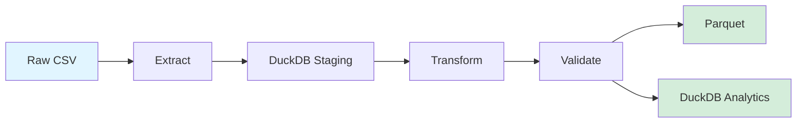

# 🔍 IEEE-CIS Fraud Detection Pipeline

> Modern, scalable ETL/ELT pipeline for fraud detection using DuckDB, Polars, and Apache Airflow

[](https://www.python.org/downloads/)
[](https://www.docker.com/)
[](LICENSE)
[](https://github.com/psf/black)

## 📋 Table of Contents

- [About](#about)
- [Architecture](#architecture)
- [Tech Stack](#tech-stack)
- [Features](#features)
- [Project Phases](#project-phases)
- [Getting Started](#getting-started)
- [Usage](#usage)
- [Performance](#performance)
- [Testing](#testing)
- [Documentation](#documentation)
- [Contributing](#contributing)
- [License](#license)

## 🎯 About

This project implements a production-ready data pipeline for processing IEEE-CIS fraud detection dataset (~590k transactions). The pipeline demonstrates modern data engineering practices including:

- **High-performance data processing** using DuckDB and Polars
- **Orchestration** with Apache Airflow
- **Cloud integration** with Google Cloud Platform (BigQuery, GCS)
- **Data quality validation** with Great Expectations
- **Containerization** with Docker
- **Comprehensive testing** with pytest

**Dataset**: [IEEE-CIS Fraud Detection (Kaggle)](https://www.kaggle.com/c/ieee-fraud-detection)

## 🏗️ Architecture

```
┌─────────────────────────────────────────────────────────────────┐
│                         PHASE 1: Foundation                      │
│                                                                  │
│  Raw CSV ──> DuckDB ──> Transform ──> Parquet ──> Analytics    │
│              (staging)  (Polars)    (partitioned)   (DuckDB)    │
│                                                                  │
│              Orchestrated by Apache Airflow                      │
└─────────────────────────────────────────────────────────────────┘

┌─────────────────────────────────────────────────────────────────┐
│                    PHASE 2: Cloud Integration                    │
│                                                                  │
│  Parquet ──> GCS ──> BigQuery ──> Analytics Dashboard          │
│            (storage) (warehouse)   (Looker Studio)              │
│                                                                  │
│              + Great Expectations Validation                     │
└─────────────────────────────────────────────────────────────────┘

┌─────────────────────────────────────────────────────────────────┐
│                 PHASE 3: Scale & Real-time (Future)             │
│                                                                  │
│  Kafka ──> Spark Streaming ──> Feature Store ──> ML Model      │
│         (simulation)         (Redis/BigQuery)   (MLflow)        │
└─────────────────────────────────────────────────────────────────┘
```

### Data Flow (Phase 1)



## 🛠️ Tech Stack

### Core Technologies

| Component            | Technology                  | Purpose                                        |
| -------------------- | --------------------------- | ---------------------------------------------- |
| **Data Processing**  | DuckDB + Polars             | High-performance analytics and transformations |
| **Orchestration**    | Apache Airflow              | Workflow management and scheduling             |
| **Storage**          | Parquet (columnar)          | Efficient data storage with partitioning       |
| **Cloud**            | Google Cloud Platform       | BigQuery (warehouse) + GCS (storage)           |
| **Data Quality**     | Great Expectations          | Data validation and profiling                  |
| **Testing**          | pytest + Great Expectations | Unit and integration tests                     |
| **Containerization** | Docker Compose              | Local development environment                  |

### Why These Technologies?

#### DuckDB

- **10-100x faster** than Pandas for analytical queries
- SQL interface (leverage existing SQL skills)
- Zero-configuration (embedded database)
- Perfect for OLAP workloads

#### Polars

- **5-10x faster** than Pandas for transformations
- Lazy evaluation (query optimization)
- Efficient memory usage
- Growing adoption in data engineering

#### Parquet

- Columnar storage (fast aggregations)
- Excellent compression (~80% size reduction)
- Schema evolution support
- Industry standard for data lakes

## ✨ Features

### Phase 1 (Current) ✅

- [x] CSV to DuckDB ingestion
- [x] Data cleaning and validation
- [x] Feature engineering pipeline
- [x] Parquet export with partitioning
- [x] Airflow DAG orchestration
- [x] Docker Compose setup
- [x] Structured logging
- [x] Unit tests

### Phase 2 (In Progress) 🚧

- [ ] Google Cloud Storage integration
- [ ] BigQuery data warehouse
- [ ] Great Expectations suite
- [ ] Performance benchmarking
- [ ] CI/CD with GitHub Actions
- [ ] Incremental loading

### Phase 3 (Planned) 📋

- [ ] PySpark distributed processing
- [ ] Streaming simulation with Kafka
- [ ] Feature store implementation
- [ ] ML model integration (MLflow)
- [ ] Grafana monitoring dashboard

## 🚀 Project Phases

### Phase 1: Foundation (Weeks 1-2)

**Goal**: Build reliable ETL pipeline with modern tools

**Deliverables**:

- Working Airflow DAG
- DuckDB + Polars transformations
- Partitioned Parquet output
- Docker Compose setup
- Unit tests (80%+ coverage)

### Phase 2: Cloud & Quality (Weeks 3-4)

**Goal**: Production-ready pipeline with cloud integration

**Deliverables**:

- GCP integration (BigQuery + GCS)
- Data quality validation
- Performance benchmarks
- Enhanced monitoring
- CI/CD pipeline

### Phase 3: Scale & Real-time (Weeks 5-6)

**Goal**: Demonstrate distributed processing and streaming

**Deliverables**:

- PySpark processing
- Kafka streaming simulation
- Feature store
- ML integration

## 🏁 Getting Started

### Prerequisites

```bash
# Required
- Docker Desktop (20.10+)
- Docker Compose (2.0+)
- Python 3.11+
- Git

# Optional
- Google Cloud SDK (for Phase 2)
- kubectl (for Kubernetes deployment)
```

### Quick Start

```bash
# 1. Clone the repository
git clone https://github.com/yourusername/fraud-detection-pipeline.git
cd fraud-detection-pipeline

# 2. Copy environment variables
cp .env.example .env
# Edit .env with your configurations

# 3. Download dataset
./scripts/download_data.sh

# 4. Start services
docker-compose up -d

# 5. Access Airflow UI
open http://localhost:8080
# Default credentials: airflow / airflow

# 6. Trigger the DAG
# Via UI or CLI:
docker-compose exec airflow-scheduler airflow dags trigger fraud_etl_dag
```

### Manual Setup (without Docker)

```bash
# 1. Create virtual environment
python -m venv venv
source venv/bin/activate  # On Windows: venv\Scripts\activate

# 2. Install dependencies
pip install -r requirements.txt

# 3. Initialize Airflow
export AIRFLOW_HOME=$(pwd)/airflow
airflow db init
airflow users create \
    --username admin \
    --password admin \
    --firstname Admin \
    --lastname User \
    --role Admin \
    --email admin@example.com

# 4. Start Airflow
airflow webserver --port 8080 &
airflow scheduler &
```

## 📖 Usage

### Running the Pipeline

```bash
# Option 1: Airflow UI
# Navigate to http://localhost:8080 and trigger "fraud_etl_dag"

# Option 2: CLI
docker-compose exec airflow-scheduler \
    airflow dags trigger fraud_etl_dag

# Option 3: Python script (for testing)
python -m src.extract.csv_loader
python -m src.transform.feature_engineering
python -m src.load.parquet_writer
```

### Configuration

Edit `.env` file:

```bash
# Data paths
RAW_DATA_PATH=./data/raw
PROCESSED_DATA_PATH=./data/processed
DUCKDB_PATH=./data/duckdb/fraud_analytics.duckdb

# Processing
CHUNK_SIZE=50000
N_JOBS=-1  # Use all CPU cores

# Airflow
AIRFLOW_UID=50000
AIRFLOW_GID=0

# GCP (Phase 2)
GCP_PROJECT_ID=your-project-id
GCS_BUCKET=fraud-detection-bucket
BQ_DATASET=fraud_analytics
```

### Querying Data (DuckDB)

```python
import duckdb

# Connect to database
con = duckdb.connect('data/duckdb/fraud_analytics.duckdb')

# Example: Fraud rate by hour
result = con.execute("""
    SELECT
        transaction_hour,
        COUNT(*) as total_transactions,
        SUM(isFraud) as fraud_count,
        ROUND(100.0 * SUM(isFraud) / COUNT(*), 2) as fraud_rate_pct
    FROM transactions
    GROUP BY transaction_hour
    ORDER BY transaction_hour
""").df()

print(result)
```

### Reading Parquet Files

```python
import polars as pl

# Read partitioned Parquet
df = pl.read_parquet('data/processed/parquet/**/*.parquet')

# Filter fraud transactions
fraud_df = df.filter(pl.col('isFraud') == 1)

# Aggregations
summary = (
    df
    .group_by('card1')
    .agg([
        pl.col('TransactionAmt').mean().alias('avg_amount'),
        pl.col('TransactionAmt').std().alias('std_amount'),
        pl.count().alias('transaction_count')
    ])
)
```

## ⚡ Performance

### Benchmarks (590k rows)

| Operation    | Pandas | Polars | DuckDB | Speedup     |
| ------------ | ------ | ------ | ------ | ----------- |
| Load CSV     | 2.3s   | 0.8s   | 0.5s   | **4.6x**    |
| Aggregations | 5.1s   | 0.9s   | 0.4s   | **12.8x**   |
| Joins        | 3.8s   | 1.2s   | 0.6s   | **6.3x**    |
| Memory Usage | 2.1 GB | 0.8 GB | 0.3 GB | **7x less** |

_Benchmarks run on MacBook Pro M1, 16GB RAM_

### Optimization Techniques

1. **Columnar Storage**: Parquet with Snappy compression
2. **Partitioning**: By date and fraud label
3. **Lazy Evaluation**: Polars query optimization
4. **Type Downcasting**: Reduce memory footprint
5. **Parallel Processing**: Multi-core utilization

## 🧪 Testing

```bash
# Run all tests
pytest

# Run with coverage
pytest --cov=src --cov-report=html

# Run specific test suite
pytest tests/unit/
pytest tests/integration/

# Run with verbose output
pytest -v -s
```

### Test Coverage Goals

- Unit tests: **>80%** coverage
- Integration tests: Critical paths
- Data quality: Great Expectations suite

## 📚 Documentation

Detailed documentation available in `/docs`:

- [Architecture Overview](docs/architecture.md)
- [Setup Guide](docs/setup.md)
- [Phase 1 Implementation](docs/phase1.md)
- [Phase 2 Implementation](docs/phase2.md)
- [Performance Benchmarks](docs/performance.md)

## 🤝 Contributing

Contributions welcome! Please read [CONTRIBUTING.md](CONTRIBUTING.md) first.

### Development Workflow

```bash
# 1. Create feature branch
git checkout -b feature/your-feature

# 2. Install dev dependencies
pip install -r requirements-dev.txt

# 3. Install pre-commit hooks
pre-commit install

# 4. Make changes and test
pytest

# 5. Commit (will run pre-commit hooks)
git commit -m "feat: your feature"

# 6. Push and create PR
git push origin feature/your-feature
```

## 📝 License

This project is licensed under the MIT License - see [LICENSE](LICENSE) file.

## 🙏 Acknowledgments

- [IEEE-CIS Fraud Detection Dataset](https://www.kaggle.com/c/ieee-fraud-detection)
- [DuckDB](https://duckdb.org/) - Fast OLAP database
- [Polars](https://www.pola.rs/) - Lightning-fast DataFrame library
- [Apache Airflow](https://airflow.apache.org/) - Workflow orchestration

## 📬 Contact

**Serghei Matenko**

- Email: sergey.revo@outlook.com
- LinkedIn: [serghei-matenko](https://linkedin.com/in/serghei-matenko)
- GitHub: [@Revo69](https://github.com/Revo69)

---

⭐ **Star this repo** if you find it helpful!

**Project Status**: 🚧 Phase 1 in progress (see [PROJECT_ROADMAP.md](docs/PROJECT_ROADMAP.md))
